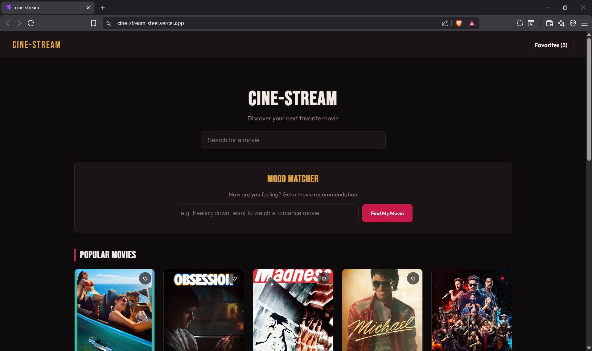
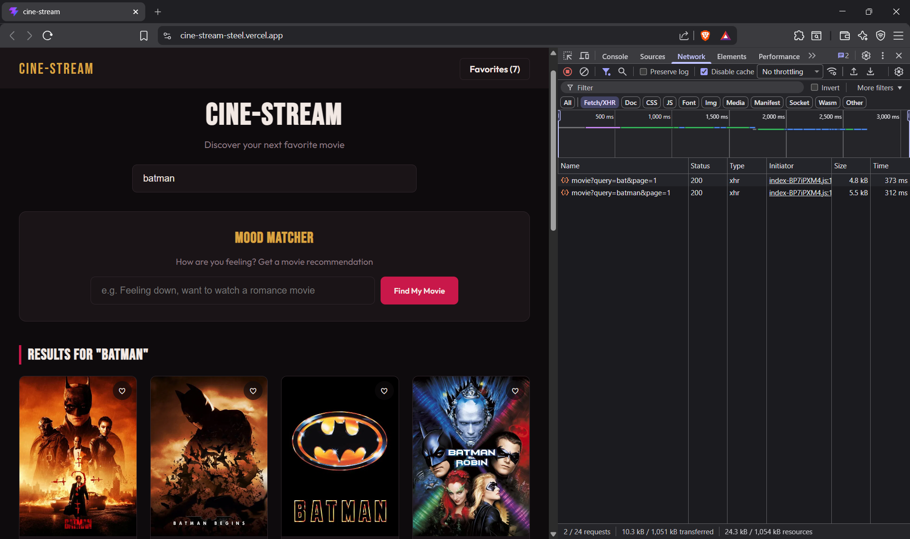
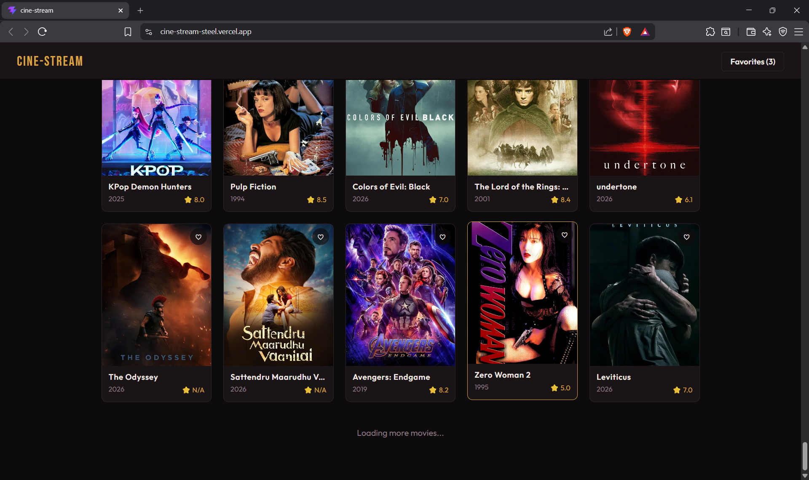
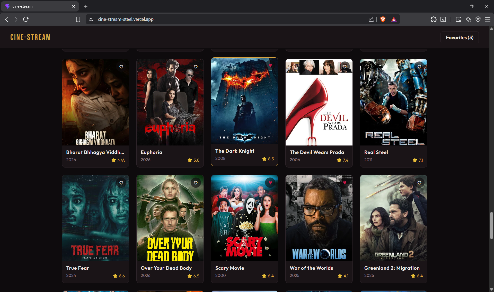
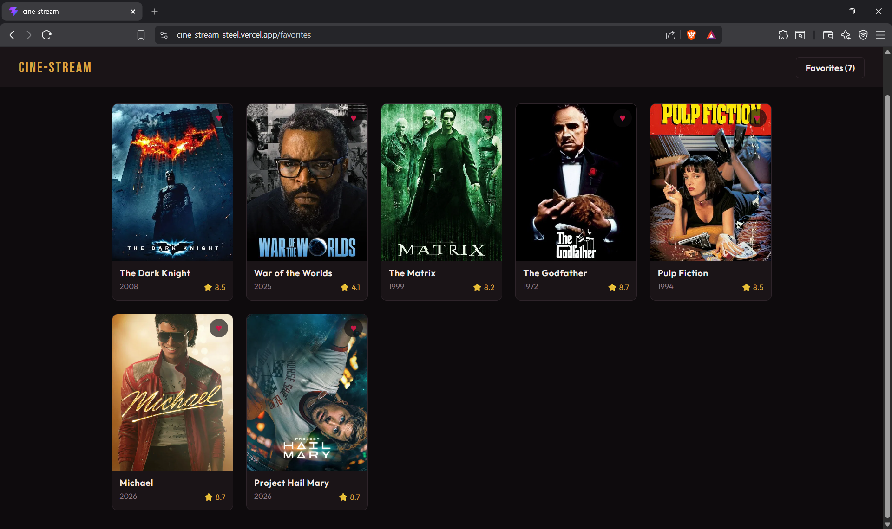
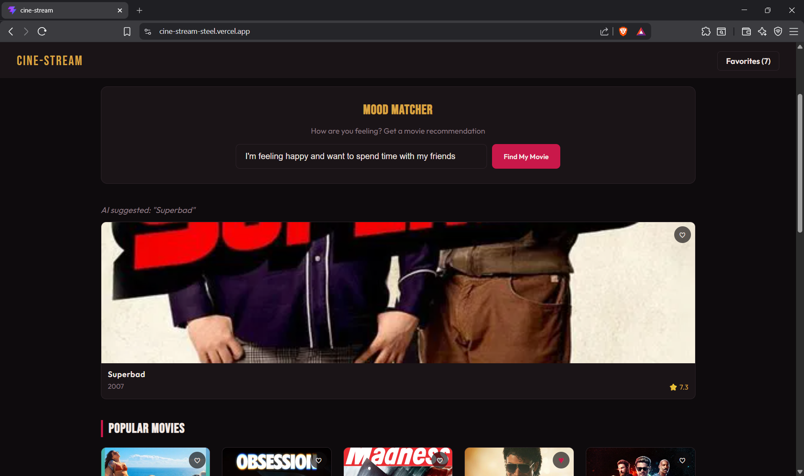
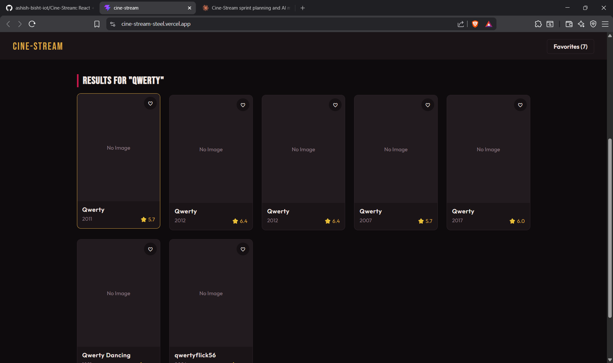
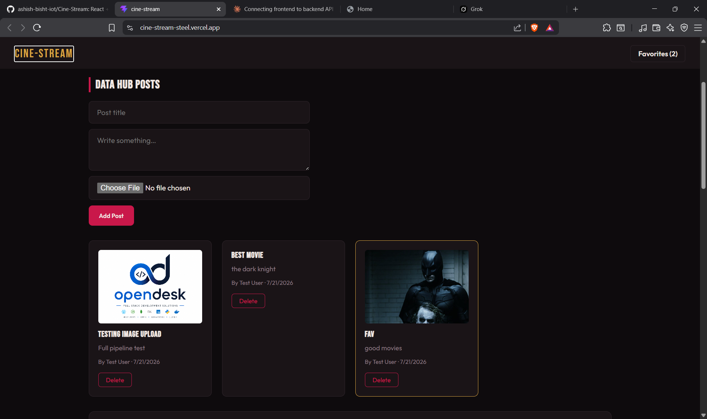

# Cine-Stream

A Netflix-lite movie discovery SPA built in React + Vite, consuming the TMDB API. Built around two core performance patterns — debounced search and infinite scroll — plus an AI mood-to-movie matcher and a full-stack Data Hub integration on top.

---

### Popular Movies Grid



---

### Debounced Search



---

### Infinite Scroll



---

### Favorites — Heart a Movie



---

### Favorites Page — Persisted on Reload



---

### Mood Matcher



---

### Missing Poster Fallback



---

### Data Hub Posts — Fullstack CRUD + Image Upload



---

## Project Structure

```
cine-stream/
├── index.html
├── vite.config.js
├── package.json
├── .env.example                     ← template for required env vars
├── Prompts.md
├── README.md
└── src/
    ├── main.jsx                     ← entry point, wraps app in Router + FavoritesProvider
    ├── App.jsx                      ← route definitions (/ and /favorites)
    ├── App.css                      ← all component styling
    ├── index.css                    ← CSS variables, font imports, global reset
    ├── components/
    │   ├── Navbar.jsx                ← top nav, favorites count
    │   ├── SearchBar.jsx             ← controlled search input
    │   ├── MovieCard.jsx             ← poster, title, year, rating, heart button
    │   ├── MoodMatcher.jsx           ← mood input → Groq → TMDB handoff
    │   ├── PostCard.jsx              ← single Data Hub post, optional image, delete
    │   └── PostsSection.jsx          ← fetch/create/delete posts against Data Hub API
    ├── pages/
    │   ├── Home.jsx                  ← popular/search grid, infinite scroll, mood matcher, Data Hub posts
    │   └── Favorites.jsx             ← renders favorites from context
    ├── context/
    │   └── FavoritesContext.jsx      ← useReducer + localStorage sync
    ├── hooks/
    │   ├── useDebounce.js            ← delays value updates by 500ms
    │   └── useInfiniteScroll.js      ← IntersectionObserver ref callback
    └── utils/
        └── tmdb.js                   ← axios instance + fetchPopularMovies, searchMovies
```

<br/>

## Backend Integration

This app connects to [Data Hub](https://github.com/ashish-bisht-iot/data-hub), a separate Express + MongoDB REST API, via the `VITE_API_URL` environment variable. Locally this points to `http://localhost:5000`; in production it points to the live Render deployment.

<br/>

| | |
|---|---|
| **Live Demo** | [cine-stream-steel.vercel.app](https://cine-stream-steel.vercel.app/) |
| **Repository** | [github/ashish-bisht-iot/Cine-Stream](https://github.com/ashish-bisht-iot/Cine-Stream) |
| **Backend Repo** | [github/ashish-bisht-iot/data-hub](https://github.com/ashish-bisht-iot/data-hub) |
| **Backend Live** | [data-hub-5hv9.onrender.com](https://data-hub-5hv9.onrender.com) |

<br/>
